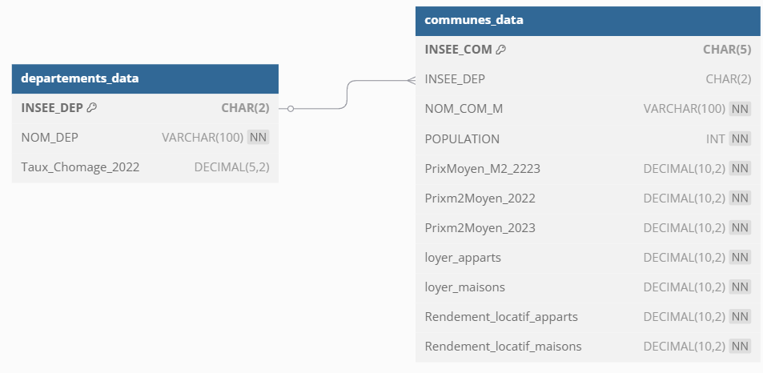
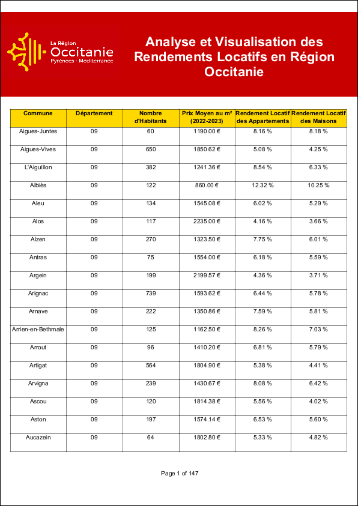
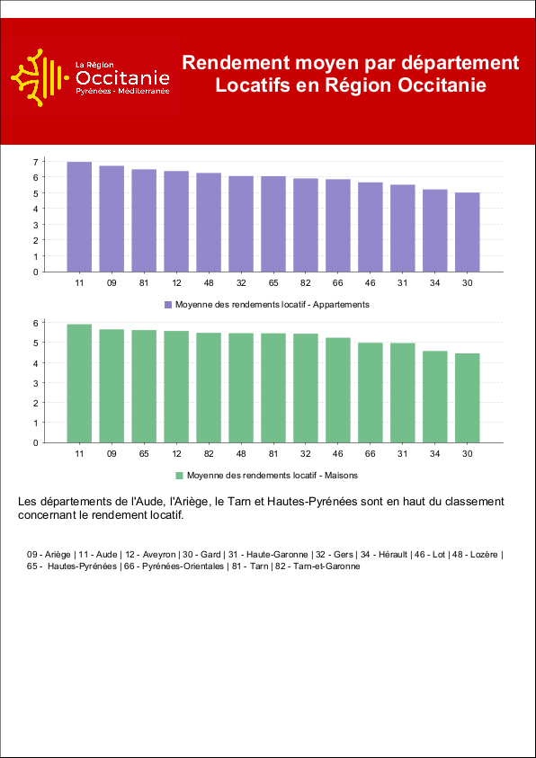

# 🏠 Optimized Rental Yield Visualization for Occitanie Region


This project is designed to assist real estate investors in identifying areas with high rental yields in the Occitanie region. Using open data sources (DVF, INSEE, etc.), we calculate rental yields and present the results using tables and charts built with JasperReports.

## ⚙️ Prerequisites
Before getting started, ensure you have the following installed:

🐋 Docker

🐍 Python 3.X

✨ Jaspersoft Studio Community Edition 7.0.1

## 🚀 How to Run the Project
 Follow these steps to set up and run the project:

Clone the repository:


```
git clone https://github.com/JonathanDS30/Optimized-Rental-Yield-Visualization-for-Occitanie-Region.git
cd Optimized-Rental-Yield-Visualization-for-Occitanie-Region
```
Start the Docker container:

```docker-compose up -d```

Install Python dependencies :

```
cd scripts
pip install -r requirements.txt
```

Process and insert data into the database : Run the following script to process data and populate the database:

```python scripts/merge_dvf_loyers_rendement.py```

Import Jasper reports : Open Jaspersoft Studio and import the jasper_project/MyReports folder to visualize the charts and tables.

## 📂 Project Structure
```
OPTIMIZED-RENTAL-YIELD-VISUALIZATION-FOR-OCCITANIE-REGION
│
├── README.md                // Project README
├── LICENSE                  // Project license
├── docker-compose.yml       // Docker Compose file
│
├── data
│   ├── processed
│   │   └── prixm2_loyer_rendement_communes.csv // Processed CSV with merged data
│   └── raw
│       ├── ECRT2023-F12.xlsx                  // Raw Excel file for unemployment rates
│       ├── dvf2022.csv                        // DVF 2022 raw data
│       ├── dvf2023.csv                        // DVF 2023 raw data
│       ├── Indicateurs_Appartement_2022.csv   // Indicators for apartments
│       ├── Indicateurs_Maison_2022.csv        // Indicators for houses
│       └── donnees_communes.csv               // Communes raw data
│
├── scripts
│   ├── Process_And_Insert_Data.py   // Script to merge DVF and rental data insert data
│   ├── insert_data.py               // Script to insert processed data into the database
│   └── requirements.txt             // List of required Python dependencies for the project
│
├── jasper_project
│   └── MyReports
│       └── reports
│           ├── Chart_Moy_Dep.jrxml         // Jasper report for average rental yields by department
│           ├── Evo_prix_moyen_m².jrxml     // Jasper report for the evolution of average price per square meter
│           ├── histo_prix_moy_mcarre.jrxml // Jasper report for histogram of average price per square meter
│           ├── nuage_de_points.jrxml       // Jasper report for scatter plot of yields vs prices
│           ├── Report_Démographie.jrxml    // Jasper report for demographic analysis
│           ├── Report_Occitanie.jrxml      // Jasper report for an overview of the Occitanie region
│           └── Types_Bien.jrxml            // Jasper report for property types by department
├── docs
│   ├── database
│   │   ├── sql-scripts
│   │   │   └── init.sql                // SQL script to initialize the database
│   │   └── mysql_data                  // Ignored in .gitignore
│   ├── Images
│   │   ├── CDM.png                     // Conceptual Data Model (CDM)
│   │   ├── Chart_Moy_Dep.png           // Average departmental rental yields chart
│   │   ├── Evo_prix_moyen_m².png       // Evolution of average price per square meter
│   │   ├── histo_prix_moy_mcarre.png   // Histogram of average price per square meter
│   │   ├── nuage_de_points.png         // Scatter plot for rental yields
│   │   ├── Report_Démographie.png      // Demographics report visualization
│   │   ├── Report_Occitanie.png        // Summary report visualization
│   │   ├── Schema Project.png          // Project schema
│   │   └── Types_Bien.png              // Types of real estate by department
│   └── PDF_Rapports
│       ├── Chart_Moy_Dep.pdf           // Average departmental rental yields report in PDF
│       ├── Evo_prix_moyen_m².pdf       // Evolution of average price per square meter report in PDF
│       ├── histo_prix_moy_mcarre.pdf   // Histogram of average price per square meter report in PDF
│       ├── JasperReports.pdf           // Complete JasperReports file
│       ├── nuage_de_points.pdf         // Scatter plot report in PDF
│       ├── Report_Démographie.pdf      // Demographics report in PDF
│       ├── Report_Occitanie.pdf        // Summary report in PDF
│       └── Types_Bien.pdf              // Types of real estate by department report in PDF
```
## 📊 Visuals and Schemas

### MCD (Conceptual Data Model) :



### Project Schema : 


## Example of Reports

<details>
  <summary>Overview Report on Occitanie Region Data</summary>

  

</details>

<details>
  <summary>Overview Report on Occitanie Region Data</summary>

  

</details>


## 📚 Data Sources
Here are the key datasets used in this project:

- [House & Apartment Rents : Rent Map](https://www.data.gouv.fr/fr/datasets/carte-des-loyers-indicateurs-de-loyers-dannonce-par-commune-en-2022/#/resources)
- [Real Estate Indicators by Municipality and Year (2014-2023)](https://www.data.gouv.fr/fr/datasets/indicateurs-immobiliers-par-commune-et-par-annee-prix-et-volumes-sur-la-periode-2014-2023/#/resources)
- [Number of Inhabitants in 2022 : INSEE Population](https://www.insee.fr/fr/statistiques/8290591?sommaire=8290669)
- [Unemployment Rate by Department in 2022 : INSEE Unemployment](https://www.insee.fr/fr/statistiques/7456887?sommaire=7456956#figure4_radio1)
